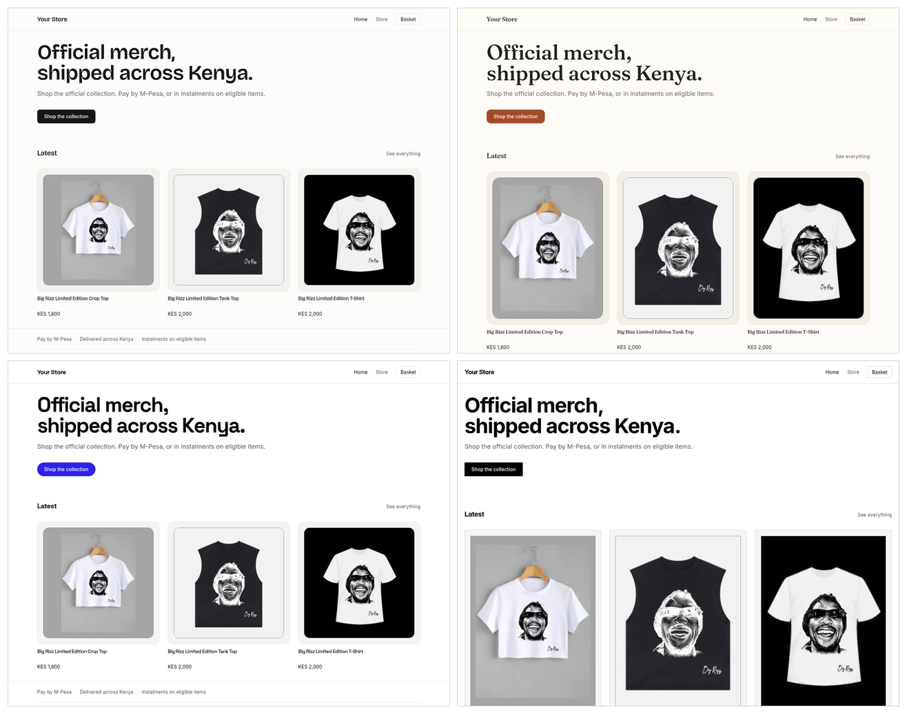

# Sokko storefront template

A working merch store on your own domain, selling your Sokko catalogue. Next.js
App Router, TypeScript, Tailwind, and [`@sokkoke/storefront-react`](https://www.npmjs.com/package/@sokkoke/storefront-react).

Clone it, paste one id, and you have a store. Change the theme file and the site
config, and it is the client's store.



One component tree, four identities: **Studio**, **Warm**, **Bold**, **Mono**.
Nothing above is a fork — colour, radius, tile ratio, elevation and rhythm are
all tokens, and the only other difference is the typeface. Screenshots run
against a live Sokko catalogue.

## What Sokko owns, what you own

Sokko owns the money. Checkout, M-Pesa, instalments, delivery and repricing all
happen on Sokko's checkout page. This site never touches payments, addresses or
inventory holds, which is why it needs no API key and no server secrets: it
reads Sokko's public storefront endpoints and hands the buyer over at the end.

You own every pixel. The SDK ships logic and structure with no styling layer.
Everything in `app/` and `components/` here is a suggestion you are meant to
replace.

## Quick start

```bash
npm install
cp .env.example .env.local     # then set NEXT_PUBLIC_SOKKO_STOREFRONT_ID
npm run dev
```

The storefront id is in the Sokko seller dashboard under **Settings →
Developers**. That page shows your real value. Until you set it, the store
pages render a short setup notice instead of failing.

Then open **`/style`**. It is the whole kit on one page: every colour, every
type size, every control, every loading, empty and error state, and all four
themes side by side. It is how you check a rebrand in five seconds instead of
clicking around the store hunting for the error screen you cannot reproduce.
Delete the route before you go live if you like.

## Make it yours

A few files carry the branding.

| File | What to change |
| --- | --- |
| `app/theme.css` | The whole visual identity. Colour, radius, image ratio, elevation, motion, spacing rhythm and the display setting. Every colour is `light-dark(light, dark)`, one line per token, so you cannot change a colour and forget its dark half. |
| `app/fonts.ts` | The typeface. Two roles: `--font-body` is what you read, `--font-title` is what you notice. |
| `app/layout.tsx` | One line: the theme class, if you are wearing a preset rather than editing `app/theme.css` directly. |
| `lib/site.ts` | Name, tagline, description, nav, social links, public URL, and the three chrome colours that a CSS variable cannot reach. |

Try a whole identity before you draw your own. Each preset is the default plus
the handful of tokens it overrides, so the file is also the explanation.

| Class | Identity | Display face |
| --- | --- | --- |
| *(none)* | [Studio](docs/screenshots/studio.png) — restrained, warm-neutral, monochrome brand | Bricolage Grotesque |
| `theme-warm` | [Warm](docs/screenshots/warm.png) — cream paper, clay brand, tall tiles, round | Fraunces |
| `theme-bold` | [Bold](docs/screenshots/bold.png) — electric brand, pill controls, heavy display | Space Grotesk |
| `theme-mono` | [Mono](docs/screenshots/mono.png) — editorial, square corners, no elevation | Inter — nothing to change |

Wearing one is two lines, not one, because a theme is colour *and* typeface and
CSS cannot reach the second:

```tsx
// app/layout.tsx
const theme = 'theme-warm';

// app/fonts.ts
export const displayFont = Fraunces({ subsets: ['latin'], variable: '--font-title' });
```

Skipping the font line is survivable, not correct: you get the preset's colour
under the default grotesk. Once you have chosen, delete the presets you are not
wearing from the imports at the top of `app/globals.css`.

After that, edit copy in `app/page.tsx` and `app/store/page.tsx`, and the store
is the client's. The favicon and the share card are generated from
`lib/site.ts`, so they are already right; drop a real `icon.png` in `app/` when
the client has a mark.

### Dark mode

`color-scheme: light dark` on `:root` follows the operating system, and every
`light-dark()` in the theme resolves from it. There is no `dark:` class
anywhere and no second set of values to keep in step.

To see both without touching your OS settings, open `/style`: the "Light and
dark" section renders the same tokens twice, because `color-scheme` scopes to
a subtree. Chrome DevTools also emulates it site-wide under Rendering, and
that is the better tool for checking a real page.

For a store that wants a manual switcher, put `scheme-light` or `scheme-dark`
on `<html>`. That is the only hook you need.

Components read tokens through Tailwind utilities (`bg-surface`, `text-muted`,
`border-line`, `bg-brand`, `rounded-card`, `shadow-card`, `aspect-tile`,
`space-y-block`, `transition-brand`). Keep it that way and a rebrand stays a
one-file change. No component names a colour, a duration or a pixel gap.

## How it is wired

Product pages render on the server, so search engines and WhatsApp get the real
title, price and image rather than a loading state. The SDK client is plain
`fetch`, so a server component can call it directly.

```
lib/sokko.ts             one storefront client, shared by server and browser
lib/cart.ts              the basket, created once at module scope
lib/site.ts              brand config
lib/styles.ts            the shared control classes
app/theme.css            every design token; app/themes/ holds three presets
app/fonts.ts             the body and display faces
app/store/page.tsx       catalogue, fetched and rendered on the server
app/store/[slug]/        product page, generateMetadata, Product + Breadcrumb JSON-LD
app/style/               the kit: every token and state on one page
app/{sitemap,robots,icon,opengraph-image}
                         the boilerplate every store needs, generated from config
lib/useCheckoutHandoff.ts the staged departure to Sokko's checkout
components/ui/           Price, Badge, ProductImage, Skeleton, Notice
components/store/        tiles and grid (server), gallery, picker, buy panel,
                         cart drawer, checkout curtain (client)
```

The split is deliberate:

- **Server**: anything that is content. Catalogue grid, product title and
  description, share tags, structured data, the sort control. These use the
  SDK's plain functions (`fromPrice`, `productImages`, `primaryImageSrcSet`).
- **Client**: anything the buyer touches. `useProductPurchase`, `useGallery` and
  `useCartDock` carry the state, the resets and the modal contract. Client
  components still server-render their first frame, so the main product image is
  in the HTML too.

### Every state is built

A store on mobile data spends real time in states a demo never sees. All of
them are on `/style`:

| Route | Waiting | Failed |
| --- | --- | --- |
| `/` | `app/loading.tsx` | `StoreError` with a retry |
| `/store` | `app/store/loading.tsx` | `StoreError` with a retry |
| `/store/[slug]` | `app/store/[slug]/loading.tsx` | `StoreError`, or `not-found` |
| anything that throws | — | `app/error.tsx` with `retry()` |

The basket has an empty state that routes back to the collection, and a product
photo that 404s falls back to the same placeholder as a product with no photo.

### Caching

`lib/sokko.ts` injects a `fetch` that carries `next: { revalidate }`, so Sokko
responses are cached at the data layer. Pages export a matching `revalidate`.

`/store` reads `?sort=`, which makes it a dynamically rendered route. The data
cache is why that does not mean a Sokko round trip per visitor. Keep the two
numbers in step: `CATALOGUE_TTL` in `lib/sokko.ts`, and the literal `revalidate`
each page exports.

## Facts about the Sokko API that shape this code

Do not fight these. They are already handled.

- **KES amounts are whole shillings.** `formatPrice(1500)` is `KES 1,500`. Never
  divide by 100.
- **Media paths are root-relative** and must be rebased, or they 404 on your
  domain. The client does it. Read images through `storefront.productImages()`.
- **The basket is local to the browser.** A Sokko cart is created once, at
  checkout, from variant ids and quantities. The title and price stored on a
  basket line are for display only, so a stale local price can never become a
  stale charge.
- **Checkout is a full navigation to Sokko.** Say so before it happens, and
  stage the jump. `CheckoutNotice` renders the SDK's proven wording, including
  the instalment line on eligible items. `CheckoutCurtain` covers the page and
  waits, so the origin change is not a white flash. Both are on `/style`; the
  curtain has a preview button, because it is the one state you cannot reach
  without starting a real checkout.
- **Related products come from this catalogue only.** Sokko's recommender covers
  the whole marketplace and could put another seller's product under your
  masthead.
- **`sort` is an opaque string and only `newest` is published.** The price
  orderings on `/store` are applied locally, in `sortProducts`. Do not guess an
  API value; it fails silently.
- **Write requests need an idempotency key.** The client attaches one.

## Deploy

Any Node host. Vercel is the shortest path: import the repo, set
`NEXT_PUBLIC_SOKKO_STOREFRONT_ID` and `NEXT_PUBLIC_SITE_URL`, deploy.

Everything here is public by design. There are no server-side secrets to leak,
which is why every variable is `NEXT_PUBLIC_`.

## Checks

```bash
npm run typecheck
npm run lint
npm run check:contrast
npm run build
```

`check:contrast` reads the theme files directly and holds every text pair, in
every theme, in both modes, to WCAG AA. Add a preset to `app/themes/` and it
is covered automatically. It is the check that catches the colour nobody
looks at: an error line on a card, or text inside a tinted badge.

`npm run build` succeeds with no `.env` at all, so a fresh clone always builds.

## License

MIT. See [LICENSE](LICENSE). Use it for client work, change anything, ship it.
